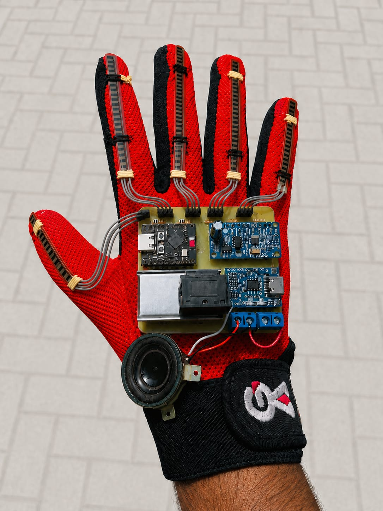
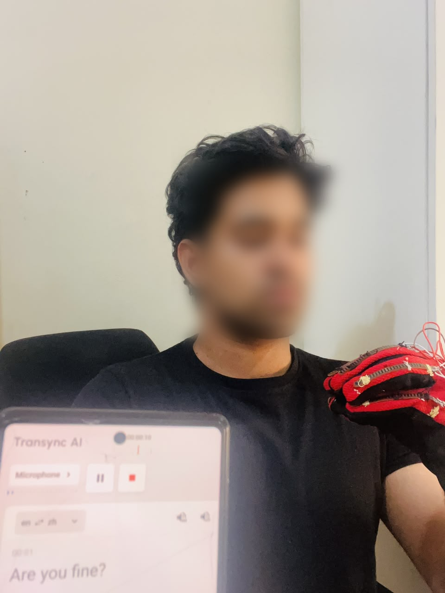
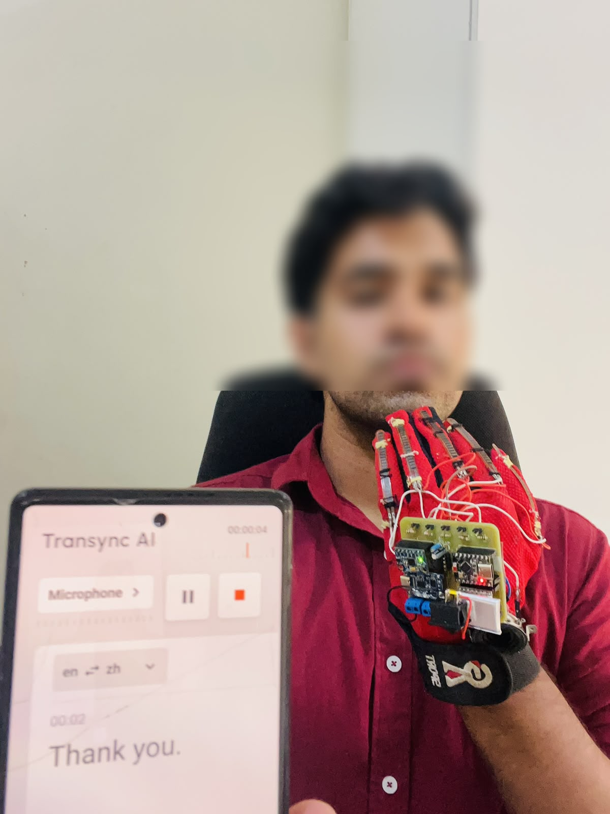
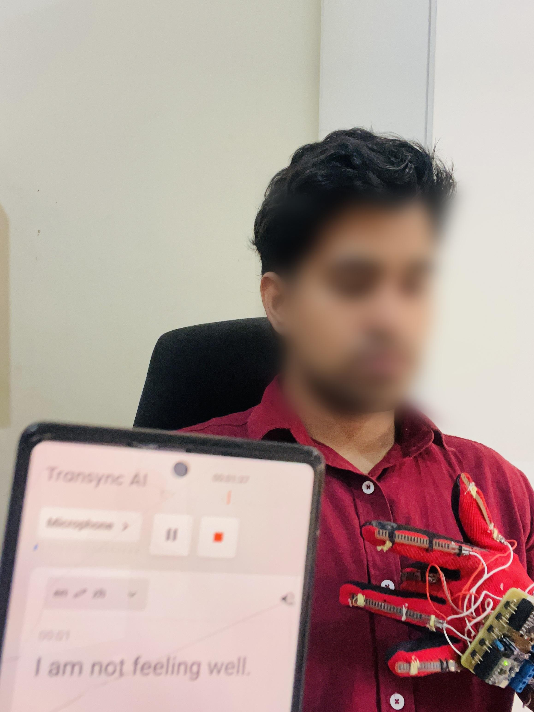
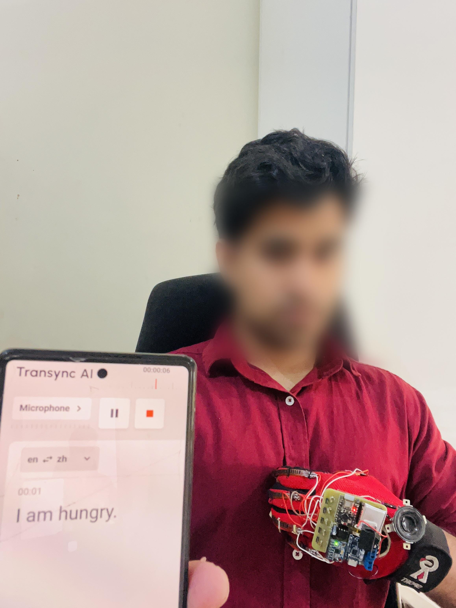
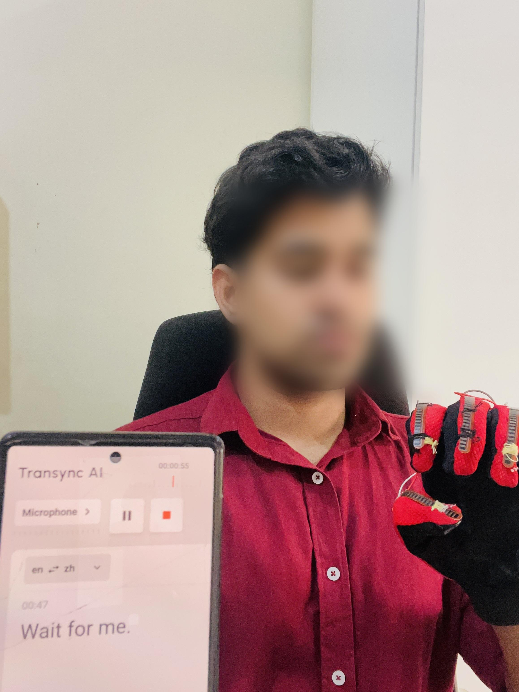

# SIGN SPEAK: A Smart Glove for Real-Time Sign Language to Speech Conversion

> A wearable assistive-technology project that translates selected sign-language gestures into speech using sensor fusion, embedded systems, and machine learning.

## Project Highlights

- Wearable smart-glove prototype for sign-language recognition
- Multi-sensor data acquisition using flex sensors and an IMU
- Sensor-fusion-based gesture classification
- Lightweight machine-learning model for embedded deployment
- Real-time gesture-to-speech conversion
- Designed with Edge AI and assistive-technology applications in mind
  
## Overview

**SIGN SPEAK** is a smart-glove prototype designed to help bridge communication between sign-language users and people who may not understand sign language.

The system combines wearable sensors, embedded processing, machine learning, and audio output to recognize selected hand gestures and convert them into corresponding spoken phrases in real time.

## Prototype & Demonstration

### Final Prototype

  

  <em>Final prototype of the SIGN SPEAK smart glove.</em>

### Gesture Recognition Demonstration

The following examples show selected gesture inputs and their corresponding recognized outputs from the developed system.

<table>
  <tr>
    <td align="center">
       
      <em>Gesture Output 1</em>
    </td>
    <td align="center">
       
      <em>Gesture Output 2</em>
    </td>
  </tr>
  <tr>
    <td align="center">
       
      <em>Gesture Output 3</em>
    </td>
    <td align="center">
       
      <em>Gesture Output 4</em>
    </td>
  </tr>
  <tr>
    <td align="center">
       
      <em>Gesture Output 5</em>
    </td>
    <td align="center"></td>
  </tr>
</table>

## Objectives

* Develop a wearable glove for sign-language gesture recognition
* Capture hand and motion information using multiple sensors
* Apply sensor-fusion techniques for gesture classification
* Develop a lightweight machine-learning model suitable for embedded deployment
* Perform real-time inference on a microcontroller
* Convert recognized gestures into audible speech

## System Concept

The overall system follows a sensor-to-speech pipeline:

**Hand Gesture → Sensor Data → Signal Processing → Machine Learning → Gesture Recognition → Audio Output**

The glove captures changes in finger movement and hand orientation through multiple sensors. The collected information is processed and classified by a machine-learning model running within the embedded system.

## Hardware

The prototype integrates:

* ESP32-based microcontroller
* Flex sensors for finger movement
* MPU6050 IMU for motion and orientation
* Audio playback module
* Audio amplifier and speaker
* Rechargeable power source
* Custom-designed PCB

## Machine Learning

A lightweight machine-learning approach was developed for real-time gesture classification and embedded deployment.

The project involved:

* Sensor-data collection
* Data preprocessing
* Feature preparation
* Dataset augmentation
* Model training and evaluation
* Model optimization for embedded inference
* Real-time deployment

The final system was designed with resource-constrained embedded hardware in mind.

## Results

The developed prototype successfully recognized **six selected sign-language gestures** and converted the recognized gestures into corresponding audio output.

### Key Results

| Metric                       |    Result |
| ---------------------------- | --------: |
| Gesture classes              |         6 |
| Original samples             |       480 |
| Neural-network test accuracy |    97.92% |
| Model parameters             |    12,838 |
| Model size                   |    ~50 KB |
| Embedded inference           | Real-time |

> Reported results are based on the final project evaluation and experimental testing.

## Technologies

`Python` · `C/C++` · `Machine Learning` · `TensorFlow Lite` · `ESP32` · `Sensor Fusion` · `Embedded Systems` · `IoT` · `Wearable Computing`

## Project Highlights

* Wearable and portable design
* Multi-sensor data fusion
* Machine-learning-based gesture recognition
* Embedded AI deployment
* Real-time gesture-to-speech conversion
* Custom hardware integration

## Future Work

Future development could focus on:

* Expanding the gesture vocabulary
* Improving robustness across different users
* Supporting continuous gesture recognition
* Improving noise tolerance and sensor calibration
* Exploring more efficient embedded AI techniques
* Developing a more compact and ergonomic hardware design
* Integrating additional communication and accessibility features

## Project Contribution

This project involved interdisciplinary work across:

* Electronics and embedded systems
* Sensor integration
* Data acquisition
* Machine learning
* Model deployment
* Hardware-software integration
* Real-time system development

## Intellectual Property Notice

This repository is intended for **academic and portfolio demonstration purposes**.

Detailed source code, raw datasets, trained model files, calibration parameters, PCB design files, schematics, and other implementation-specific materials are not publicly distributed.

**© 2026 SIGN SPEAK Project. All rights reserved.**

## Project Status

**Completed Academic Project**

The prototype was developed and evaluated as a final-year engineering project.

---

### Areas of Interest

**Artificial Intelligence · Machine Learning · Embedded Systems · IoT · Automation · Assistive Technology**
