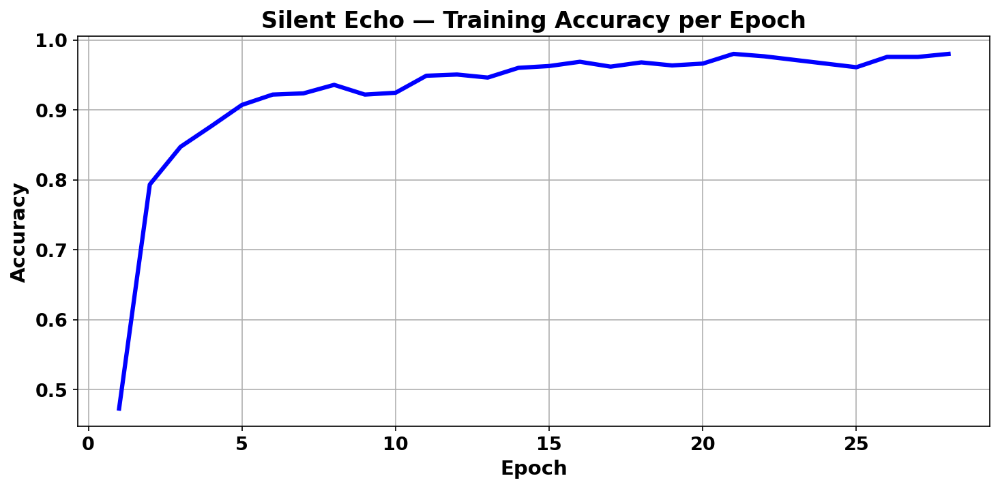
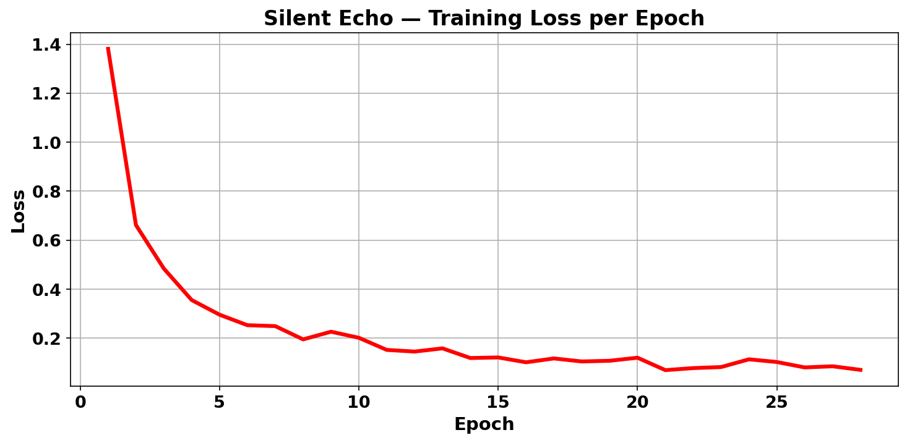
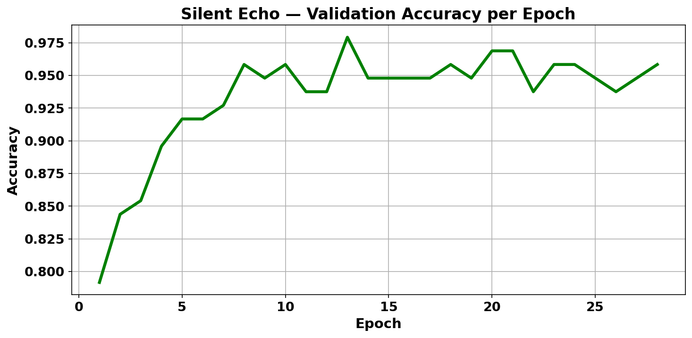
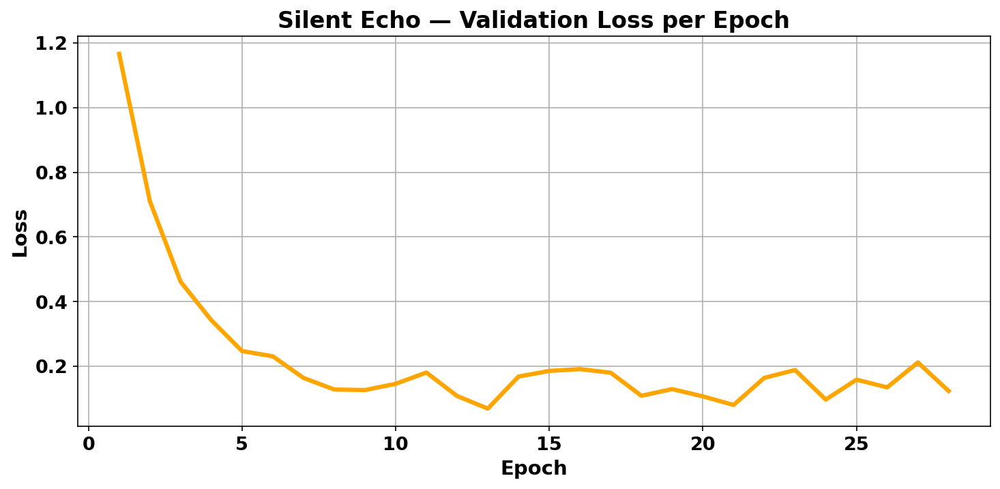
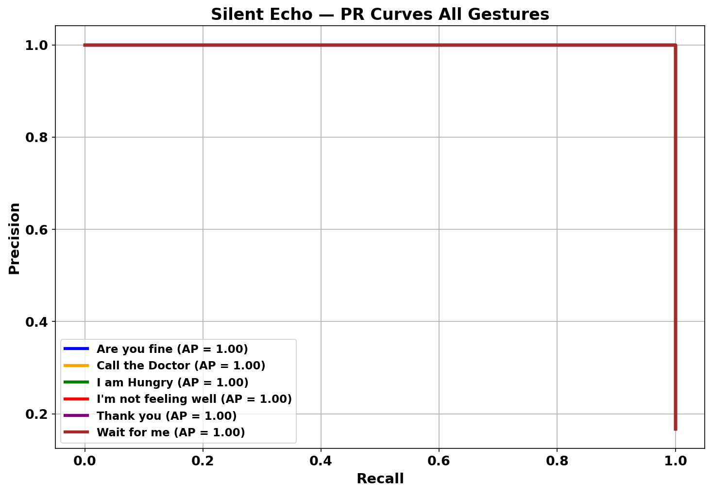

# Results & Evaluation

## Overview

SIGN SPEAK was evaluated to assess its ability to recognize selected sign-language gestures using the developed wearable sensing and machine-learning system.

The evaluation focused on **gesture-classification performance, model efficiency, and real-time embedded operation**.

---

## Key Results

| Metric                       |    Result |
| ---------------------------- | --------: |
| Gesture classes              |         6 |
| Original dataset samples     |       480 |
| Neural-network test accuracy |    97.92% |
| Model parameters             |    12,838 |
| Approximate model size       |    ~50 KB |
| Embedded inference           | Real-time |

---

## Classification Performance

The machine-learning model achieved a **97.92% test accuracy** on the evaluated dataset.

This result indicates that the selected sensor features were able to provide useful information for distinguishing between the predefined gesture categories.

The system was evaluated across six selected gesture classes:

* Are you fine
* Call the Doctor
* I am Hungry
* I'm not feeling well
* Thank you
* Wait for me

---

## Embedded Performance

A key objective of the project was to perform machine-learning inference on the embedded platform rather than relying entirely on an external computer.

The resulting model was kept lightweight enough for deployment on resource-constrained hardware.

The reported inference performance demonstrated the feasibility of performing gesture classification locally on the embedded system.

---

## Model Efficiency

The deployed neural-network model contains:

**12,838 parameters**

with an approximate model size of:

**50 KB**

The relatively compact model demonstrates the feasibility of deploying machine-learning functionality on a microcontroller-based wearable device.

---

# Results

> **Project Naming Note:** The project was developed as **SIGN SPEAK** during the Final Year Project. **SilentEcho** was the name used for the research paper and associated model evaluation results. Both names refer to the same project.

## Model Evaluation

The neural-network model was evaluated using training and validation performance metrics, along with precision-recall analysis across the selected gesture classes.

### Training Performance

The training curves show the model's learning behavior throughout the training process.

  

  

### Validation Performance

Validation accuracy and loss were monitored to evaluate the model's performance on data separate from the training set.

  

  

### Precision-Recall Analysis

The precision-recall curve provides an additional view of classification performance across the selected gesture categories.

  

## Evaluation Approach

The evaluation process involved:

1. Collecting sensor data for the selected gesture classes
2. Preparing the collected data for machine-learning evaluation
3. Training the classification model
4. Evaluating the model on held-out test data
5. Optimizing the model for embedded deployment
6. Testing the deployed system on the target hardware

---

## Real-Time Demonstration

The final prototype demonstrated the complete pipeline:

**Gesture → Sensor Acquisition → Processing → Classification → Audio Output**

The system was able to perform gesture recognition locally and produce the corresponding predefined audio output.

---

## Interpreting the Results

The reported accuracy represents performance on the evaluated dataset and should not be interpreted as universal recognition accuracy across all users, environments, or signing styles.

Further testing with a larger and more diverse dataset would be required to evaluate real-world generalization.

---

## Future Evaluation

Future experiments could evaluate:

* Performance across a larger number of participants
* Generalization to unseen users
* Performance under different hand positions and orientations
* Sensor noise and drift
* Continuous gesture recognition
* Larger gesture vocabularies
* Long-term wearable operation
* Power consumption during continuous use

---

## Intellectual Property Notice

This public results document intentionally excludes confidential implementation details such as:

* Raw sensor dataset
* Complete source code
* Trained model files
* Calibration parameters
* Detailed preprocessing parameters
* Exact hardware wiring
* PCB design files

The repository is intended for **academic and portfolio demonstration purposes**.

**© 2026 SIGN SPEAK Project. All rights reserved.**
